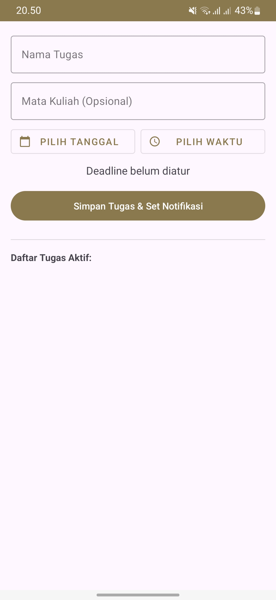
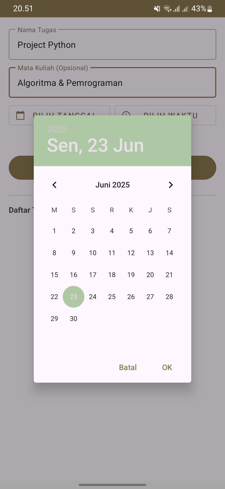
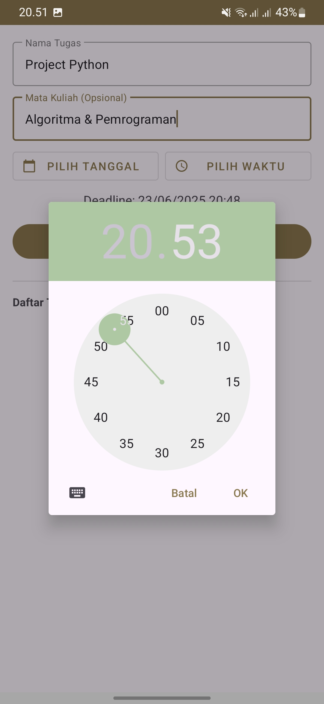
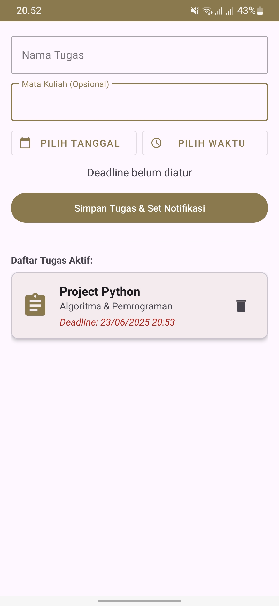
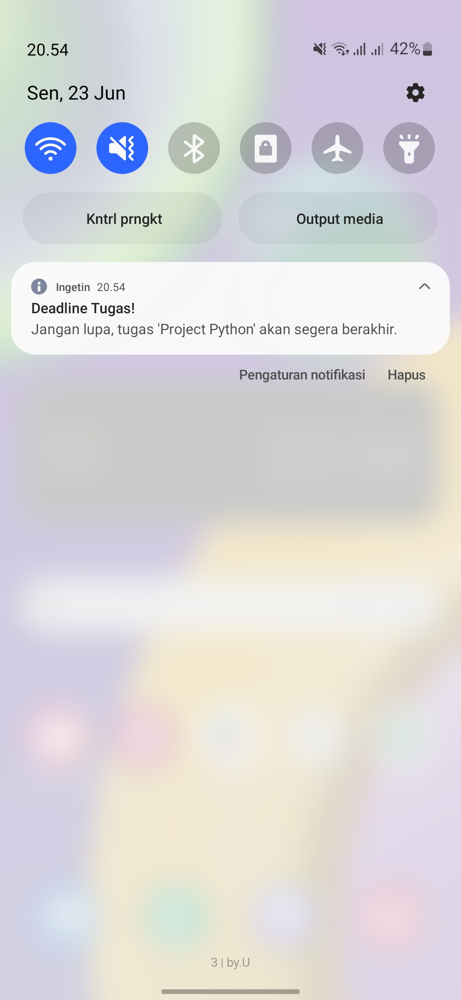

# Ingetin - Aplikasi Pengingat Tugas

Aplikasi Android sederhana untuk membantu mahasiswa atau pengguna umum dalam mencatat tugas dan mengatur notifikasi deadline agar tidak terlewat. Aplikasi ini dibuat sebagai Proyek Ujian Akhir Semester Pemrograman Mobile Dasar.

## Screenshot Aplikasi

  
  
  
  
  

## Fitur Utama
- **Manajemen Tugas:** Menambah, melihat, dan menghapus daftar tugas.
- **Input Deadline:** Memilih tanggal dan waktu deadline dengan `DatePicker` dan `TimePicker`.
- **Notifikasi Tepat Waktu:** Menggunakan `AlarmManager` untuk menjadwalkan dan `NotificationManager` untuk menampilkan notifikasi saat deadline tiba.
- **Penyimpanan Lokal:** Semua data tugas disimpan secara aman di dalam database SQLite lokal di perangkat.
- **Tampilan Modern:** Antarmuka yang bersih dan menarik menggunakan komponen Material Design.

## Teknologi yang Digunakan
- **Bahasa:** Java
- **Arsitektur:** Basic/No-Architecture (Standard Android)
- **Database:** SQLite
- **Notifikasi:** AlarmManager, NotificationManager, BroadcastReceiver
- **Library:**
  - AndroidX AppCompat & Material Components
  - RecyclerView/ListView
